# Local SageMaker-Style MLOps: train → register → approve → deploy

This repo simulates an AWS SageMaker Pipelines flow 100% locally and free:
- **Train** a model and produce a `model.tar.gz` artifact (SageMaker-style).
- **Register** the trained model into a local Model Registry (versions + metadata).
- **Approve/Promote** a version to `Production`.
- **Deploy** a real-time endpoint (FastAPI) that mimics SageMaker's `/invocations`.

## Stack
- Python 3.11+
- scikit-learn, pandas, joblib
- FastAPI + Uvicorn
- No AWS account required. No Docker required (optional Dockerfile provided for the server).

## Quick start
```bash
python -m venv .venv && source .venv/bin/activate
pip install -r requirements.txt

# 1) Train (writes artifacts to ./artifacts/latest/)
make train

# 2) Register trained model as a new version in local registry
make register

# 3) Approve/promote a version to Production (default = latest)
make approve

# 4) Deploy real-time server (local SageMaker-like endpoint)
make deploy

# 5) Invoke endpoint with sample payload
make invoke


```
Endpoints (once running)
```
	•	GET http://127.0.0.1:8000/ping → "pong"
	•	POST http://127.0.0.1:8000/invocations
```
Body (JSON):
```
{ "instances": [[5.1, 3.5, 1.4, 0.2], [6.2, 3.1, 5.1, 2.3]] }
```
Returns:
```
{ "predictions": [0, 2] }
```


# 🎯 Interview & Architecture Notes

What this project demonstrates

This project simulates a SageMaker MLOps workflow end-to-end without any AWS costs. It mirrors a typical production-grade machine learning lifecycle that an SA might help design for a client or internal team.

You can describe this in interviews as showing:
```
	•	MLOps orchestration: How data scientists’ training workflows can be automated, versioned, and deployed.
	•	Separation of stages: Training, registration, approval, and deployment as modular components—mirroring CI/CD for ML.
	•	Local simulation of cloud architecture: A cost-free way to explain and demonstrate concepts such as SageMaker Pipelines, Model Registry, and real-time inference endpoints.
	•	Artifact and metadata tracking: Maintaining model lineage, metrics, and deployment states similar to SageMaker Model Registry + EventBridge triggers.
	•	Real-time inference API design: Using a FastAPI service that mimics the /invocations contract for production ML endpoints.
```
⸻

SA / Architect Talking Points

🧠 Architectural Responsibilities
```
	•	Explain how this pipeline fits into a multi-stage architecture:
Data Prep → Training → Model Registry → Deployment → Monitoring.
	•	Emphasize decoupling and reproducibility—the core of MLOps maturity.
	•	Discuss how you would evolve this into a cloud-native design:
	•	Replace the local registry with SageMaker Model Registry or MLflow Registry.
	•	Replace FastAPI with a managed SageMaker Endpoint.
	•	Automate approvals with EventBridge or Step Functions.
	•	Introduce monitoring via CloudWatch, Model Monitor, or custom Prometheus metrics.
```
⚙️ Use Cases to Mention
```
	1.	Enterprise MLOps onboarding
Show how teams can prototype an ML lifecycle locally before pushing to AWS.
	2.	Cost-controlled experimentation
Demonstrate design validation of pipelines without incurring SageMaker charges.
	3.	Training demos or client workshops
Use this project to teach MLOps concepts interactively without requiring cloud access.
	4.	Proof-of-concept accelerator
Replace components step-by-step with AWS managed services once validated locally.
```

💬 Interview phrasing examples
```
	•	“I built a local SageMaker-style MLOps pipeline to demonstrate how training, registration, and deployment stages fit together before moving to AWS managed services.”
	•	“This project helped me explain how SageMaker Pipelines, Model Registry, and Endpoints integrate — and how we could mirror that in a cost-free local simulation.”
	•	“I designed it modularly so each stage (train, register, approve, deploy) could later map directly to managed AWS services like Step Functions, SageMaker Model Registry, and CloudWatch.”
```
⸻
## 🗺️ Architecture (local SageMaker-style)

```mermaid
flowchart LR
    subgraph Dev["Local Dev Laptop ($0)"]
      A["Data (Iris)"] --> B["Train (scikit-learn)"]
      B --> C["Artifacts\nmodel.tar.gz + model_card.json"]
      C --> D["Register Version\nmodel_registry/v000X"]
      D -->|promote| E[["Approve → Production\nsymlink: model_registry/production"]]
      E --> F["Deploy FastAPI Endpoint\n/ping, /invocations"]
    end

    subgraph "Maps to AWS (conceptual)"
      B ~~~ B_AWS[(SageMaker Training Job)]
      C ~~~ C_AWS[(Model package/Artifacts in S3)]
      D ~~~ D_AWS[(SageMaker Model Registry)]
      E ~~~ E_AWS[(Approved to Prod)]
      F ~~~ F_AWS[(SageMaker Real-time Endpoint)]
    end

```



## ⚡ Inference paths

```mermaid
flowchart TB
    subgraph Real-time
      R1["Client JSON\n{instances: ...}"] --> R2["FastAPI /invocations"]
      R2 --> R3["Load Production\nmodel_registry/production/model.tar.gz"]
      R3 --> R4["Predict\ninference.py → predict_fn"]
      R4 --> R5["Response {predictions: ...}"]
    end

    subgraph "Batch (optional extension)"
      B1[CSV/Parquet input] --> B2[batch.py]
      B2 --> B3[Load Production\nmodel_registry/production]
      B3 --> B4[Vectorized Predict]
      B4 --> B5[CSV/Parquet output\nwith predictions]
    end
```

